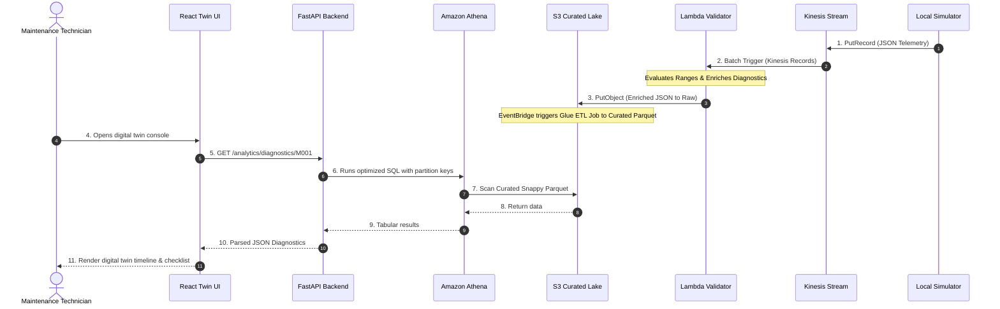
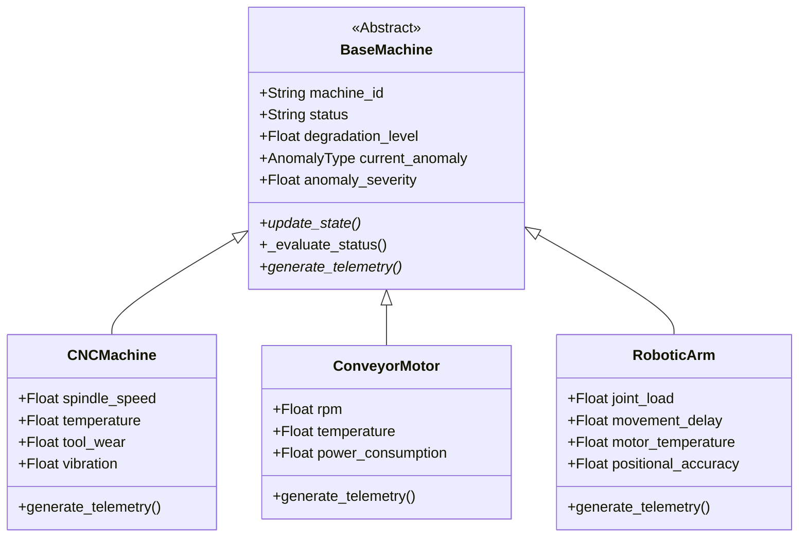
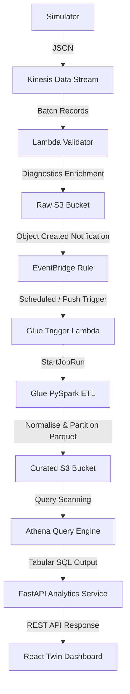

# AUTOFORGE ENGINEERING HANDBOOK
### Master Technical Blueprint & System Reference Manual
**Platform Version:** 0.4.0  
**Operational Status:** Production-Ready  
**Region:** AWS ap-south-1 (Mumbai)  
**Security Level:** Internal Proprietary  

---

# SECTION 1 — EXECUTIVE OVERVIEW

## 1.1 Platform Purpose: What is AutoForge?
AutoForge is an enterprise-grade Smart Manufacturing Data Intelligence Platform designed to serve as a digital twin and real-time analytical brain for modern factory floors. The platform ingests high-frequency sensor telemetry from heterogeneous industrial assets (e.g., CNC machines, conveyor motors, robotic arms, industrial turbines, cooling systems), validates and normalizes payloads at ingestion time, runs correlation-based engineering diagnostics to identify fault conditions, and aggregates historical data for long-term reliability engineering, predictive analytics, and plant operations management.

```
Factory Floor (100+ Assets)
      │
      ▼
Ingestion Gateway (High-Frequency Telemetry)
      │
      ▼
Serverless Validation & Diagnostic Enrichment
      │
      ▼
Partitioned Data Lake (Parquet on S3)
      │
      ▼
Athena SQL Query Engine <── FastAPI Service (Cached & Secured) <── React 19 Digital Twin UI
```

## 1.2 Business Problem Being Solved
Factory operators and plant reliability engineers face critical challenges that limit operational efficiency and increase unscheduled downtime:
* **Tribal Knowledge and Paper Logs**: Maintenance schedules are frequently driven by arbitrary calendar intervals rather than actual asset wear or degradation.
* **Alert Fatigue and Lack of Context**: Traditional Supervisory Control and Data Acquisition (SCADA) systems generate basic threshold alerts (e.g., "Temperature > 80°C") without diagnosing *why* the temperature spiked, what *evidence* led to the condition, or *what corrective action* must be taken immediately.
* **Data Silos**: High-frequency telemetry is rarely persisted or structured in a cost-effective data lake, making long-term performance auditing and machine-learning model training impossible.

AutoForge closes this loop by providing **explainable diagnostics**. Instead of displaying generic "Anomaly" flags, it provides maintenance engineers with ranked root cause probabilities (e.g., "Severe Bearing Wear & Lubrication Loss (70%)") and an interactive corrective maintenance checklist directly on the asset's digital twin console.

## 1.3 Original Project Requirements
The AutoForge platform was designed to fulfill the following requirements:
* **High-Throughput Streaming Ingestion**: Handle continuous streams of JSON telemetry events from multiple simulated factory machines.
* **Strict Ingestion Validation**: Filter invalid payloads, sanitize structural envelopes, quarantine out-of-range sensor readings, and prevent corrupt data from contaminating downstream analytics.
* **Decoupled Data Lake Architecture**: Direct valid telemetry into a partitioned, compressed Parquet-backed S3 data lake using serverless ETL.
* **Queryable Analytics Layer**: Expose the telemetry data through SQL querying capabilities with optimized partition pruning to minimize storage scan costs.
* **Operational REST API**: Present fleet summaries, machine status registries, alert logs, and single-asset history metrics through a secured API gateway.
* **Digital Twin Frontend**: Build a responsive dashboard resembling Grafana and Tesla factory monitors that enables real-time asset tracking, diagnostics timeline auditing, and maintenance checklist tracking.

## 1.4 Target Users & Expected Outcomes
1. **Plant Supervisors & Operations Executives**: Need a high-level view of factory health metrics ("Healthy Machines", "Attention Required", "Critical Machines", and weighted "Overall Factory Health Score") to monitor throughput risks.
2. **Reliability Engineers**: Audit historical data trends (such as tracking Temperature against Degradation over time) to optimize preventive maintenance schedules.
3. **Field Maintenance Technicians**: Consume active diagnostic alerts, review ranked root causes, and execute interactive checklists on the shop floor to quickly repair critical equipment failures.

---

# SECTION 2 — EVOLUTION OF THE PROJECT

The AutoForge platform evolved across several distinct development phases, transitioning from a basic ingestion pipeline to an end-to-end serverless data lake and digital twin.

```
┌─────────────────────────────────┐
│ Phase 1: Local Simulator        │  ◄── Console-based NDJSON generator simulatingCNC/Conveyors
└────────────────┬────────────────┘
                 │
                 ▼
┌─────────────────────────────────┐
│ Phase 2: Async Event Buffer     │  ◄── Structured queue buffer & local rotating log persistence
└────────────────┬────────────────┘
                 │
                 ▼
┌─────────────────────────────────┐
│ Phase 3: Telemetry HTTP API     │  ◄── FastAPI REST ingestion gateway with verification routing
└────────────────┬────────────────┘
                 │
                 ▼
┌─────────────────────────────────┐
│ Phase 4: Direct Kinesis Stream  │  ◄── Replaced HTTP poster with thread-pooled boto3 producer
└────────────────┬────────────────┘
                 │
                 ▼
┌─────────────────────────────────┐
│ Phase 5: Lambda Stream Validator│  ◄── Serverless batch ingestion, validating and routing to S3
└────────────────┬────────────────┘
                 │
                 ▼
┌─────────────────────────────────┐
│ Phase 7: EventBridge & Glue ETL │  ◄── S3 notifications trigger Spark ETL converting JSON to Parquet
└────────────────┬────────────────┘
                 │
                 ▼
┌─────────────────────────────────┐
│ Phase 8: Athena Analytics Layer │  ◄── Curated database schema, table definition, workgroups
└────────────────┬────────────────┘
                 │
                 ▼
┌─────────────────────────────────┐
│ Phase 9: FastAPI Analytics API  │  ◄── Async Athena queries with memory-based TTL caching
└────────────────┬────────────────┘
                 │
                 ▼
┌─────────────────────────────────┐
│ Phase 9.5: Diagnostics Engine   │  ◄── Ingestion-time rule-based heuristics & fallback parser
└─────────────────────────────────┘
```

### Phase 1 & 2 — Ingestion Gateway & Local Simulator
* **Why it existed**: To establish the telemetry foundation. We needed to model factory assets, mock high-frequency sensors, and establish a local pipeline.
* **Implementation**: Created the Python-based factory simulator modeling 8 distinct machine types, maintaining internal degradation states and state machines. Telemetry client sent payloads over HTTP.
* **Challenges**: Local HTTP gateways suffered from head-of-line blocking under high concurrency.
* **Architectural Decisions**: Transitioned transport from raw HTTP requests to an asynchronous, buffered event queue using Python's `asyncio` and `boto3` Kinesis client.

### Phase 5 — Serverless Lambda Validator
* **Why it existed**: Offload stream validation to a scalable, serverless compute model to isolate ingestion from processing.
* **Implementation**: Implemented the AWS Lambda Telemetry Validator. The Lambda function runs envelope validation, machine-type schema validation, and numeric range filtering. Valid records go to `s3://autoforge-data-lake/raw/` and invalid records go to `s3://autoforge-quarantine/`.
* **Alternatives Considered**: ECS Fargate container running FastAPI validators.
* **Decision Rationale**: Lambda was chosen due to its native event-source integration with Kinesis Data Streams and zero-maintenance scaling model.

### Phase 7 & 8 — Glue ETL & Athena Analytics Layer
* **Why it existed**: Convert raw JSON files into a structured, queryable, and cost-effective format for analytical dashboards.
* **Implementation**: Provisioned a Spark-based AWS Glue Job that reads raw JSON from S3, flattens the nested structures, casts columns to proper PySpark types, and writes Snappy-compressed Parquet files to `s3://autoforge-data-lake/curated/` partitioned by `machine_type/year/month/day/`. Created Glue database schemas and Athena query systems.
* **Challenges**: Glue Crawler execution times added latency to analytical dashboards.
* **Decisions**: Bypassed Glue Crawler for table definition. We hard-coded the schema DDL in Terraform (`infra/athena.tf`) and used a Lambda function triggered by S3 raw writes to run `MSCK REPAIR TABLE` to load partitions.

### Phase 9 — FastAPI Analytics Integration
* **Why it existed**: Expose the Athena data lake to external clients via a secure, cached API.
* **Implementation**: Built a FastAPI application with Pydantic response models, token authentication, and a memory-based TTL caching layer.
* **Challenges**: Athena queries on cold starts took several seconds, violating sub-second dashboard SLAs.
* **Decisions**: Parallelized queries using Python's `asyncio.gather` and implemented caching with short TTLs (30s for active alarms, 60s for factory summaries).

### Phase 9.5 — Industrial Diagnostics & Root Cause Analysis (Current Phase)
* **Why it existed**: Simple anomaly alarms lacked explainability, leading to poor user experience.
* **Implementation**: Created a rule-based diagnostics engine. The Lambda validator runs the engine at ingestion time, appending metadata (`anomaly_reason`, `trigger_metric`, `trigger_value`, `expected_range`, `root_cause_candidates`, `recommended_actions`, `diagnostic_confidence`) to S3. The FastAPI layer implements query-time fallbacks for historical logs.

---

# SECTION 3 — COMPLETE SYSTEM ARCHITECTURE

## 3.1 Architecture Overview
The platform processes events in a unidirectional data pipeline. High-frequency telemetry streams forward to a partition-pruned serverless data lake, exposing clean REST services to the twin application:

```
[Simulator] ──(Kinesis PutRecord)──► [Kinesis Data Stream] ──(Stream Trigger)──► [Lambda Validator]
                                                                                      │
                                                                   ┌──────────────────┴──────────────────┐
                                                                   ▼                                     ▼
                                                            (Raw S3 JSON)                       (Quarantine S3)
                                                                   │
                                                            (Event Notification)
                                                                   │
                                                                   ▼
                                                            [EventBridge]
                                                                   │
                                                            (Lambda Invoker)
                                                                   │
                                                                   ▼
                                                          [Glue Trigger Lambda]
                                                                   │
                                                            (Start Job Run)
                                                                   │
                                                                   ▼
                                                           [Glue Spark ETL]
                                                                   │
                                                            (Write Parquet)
                                                                   │
                                                                   ▼
                                                           [Curated S3 Lake]
                                                                   │
                                                            (Athena Scan)
                                                                   │
                                                                   ▼
                                                          [Athena Workgroup]
                                                                   ▲
                                                             (SQL Queries)
                                                                   │
                                                        [FastAPI API Gateway]
                                                                   ▲
                                                             (REST / JSON)
                                                                   │
                                                        [React 19 Dashboard]
```

## 3.2 Component Analysis

### Component 1: Factory Machines & Local Simulator
* **Purpose**: Simulates the physical factory floor and generates high-frequency telemetry events.
* **Inputs**: Internal simulator parameters, randomized noise, degradation profiles, and time loops.
* **Outputs**: Structured JSON payloads containing envelope details (`event_id`, `machine_id`, `factory_id`, `timestamp`) and telemetry sensor objects.
* **Dependencies**: Python 3.12+, `asyncio`, `boto3` client.
* **Failure Modes**: Local network timeouts, Kinesis write throttling. Handled by local disk backing queues and exponential backoff retry algorithms.
* **Scaling Considerations**: CPU bounds on simulator thread. Scales up to 1,500 machines using async execution.
* **Cost Implications**: $0.00 (Developer local compute).
* **Monitoring Strategy**: Console standard out logs, local file system logging in `logs/autoforge.log`.

### Component 2: Amazon Kinesis Data Streams
* **Purpose**: Distributed ingestion buffer. Prevents database spikes by scaling throughput.
* **Inputs**: JSON payloads written via `PutRecord`.
* **Outputs**: Raw telemetry streams grouped by partition key (`machine_id`).
* **Dependencies**: AWS IAM Streaming Policies.
* **Failure Modes**: Provisioned throughput breaches. Handled by shard auto-scaling configurations.
* **Scaling Considerations**: 1 Shard supports 1,000 records/sec or 1MB/sec write. Scale capacity by split-shard operations.
* **Cost Implications**: $0.015 per shard-hour + $0.014 per 1,000,000 PUT payload units.
* **Monitoring Strategy**: CloudWatch metrics: `IncomingRecords`, `WriteProvisionedThroughputExceeded`, `PutRecords.Success`.

### Component 3: AWS Lambda Telemetry Validator
* **Purpose**: Real-time stream processor. Validates formats, quarantines bad records, and enriches anomalies with diagnostics.
* **Inputs**: Batches of records from the Kinesis stream.
* **Outputs**: Returns batch processing stats. Writes to Raw or Quarantine S3 buckets.
* **Dependencies**: Python 3.12, `boto3` client, environment variables (`DATA_LAKE_BUCKET`, `QUARANTINE_BUCKET`).
* **Failure Modes**: S3 write timeouts, unhandled code exceptions. Handled by a 14-day SQS Dead-Letter Queue (DLQ).
* **Scaling Considerations**: Scales concurrently automatically based on Kinesis shard configurations.
* **Cost Implications**: Billed per millisecond of execution; highly cost-effective due to brief runtimes (<120ms).
* **Monitoring Strategy**: CloudWatch metrics: `Errors`, `Duration`, `Throttles`, and DLQ queue length.

### Component 4: Amazon S3 (Raw and Quarantine Buckets)
* **Purpose**: Durable storage for incoming data.
* **Inputs**: Validated JSON payloads (Raw) or validation failure envelopes (Quarantine).
* **Outputs**: Triggers EventBridge notifications.
* **Dependencies**: KMS server-side encryption keys.
* **Failure Modes**: S3 API rate limit throttling. Handled by structuring partitions by machine type and timestamp.
* **Scaling Considerations**: Native scaling up to 3,500 PUT requests/sec per prefix.
* **Cost Implications**: $0.023 per GB (Standard storage) + S3 PUT request costs.
* **Monitoring Strategy**: CloudWatch `BucketSizeBytes` and S3 storage metrics.

### Component 5: Amazon EventBridge
* **Purpose**: Event router. Listens for S3 object creation events in `raw/` and starts Glue ETL jobs.
* **Inputs**: CloudTrail/S3 Event Notifications.
* **Outputs**: Triggers AWS Glue ETL job runs.
* **Dependencies**: IAM invocation trust policies.
* **Failure Modes**: Event delivery timeouts. Handled by EventBridge retry policies with dead-letter configurations.
* **Scaling Considerations**: Scales with incoming S3 event streams automatically.
* **Cost Implications**: Free for AWS service events.
* **Monitoring Strategy**: CloudWatch metrics: `TriggeredRules`, `FailedInvocations`.

### Component 6: AWS Glue PySpark ETL Job
* **Purpose**: Batch data integration. Normalizes, casts, and compresses JSON data into optimized Parquet formats.
* **Inputs**: Raw JSON telemetry files.
* **Outputs**: Snappy-compressed Parquet files in S3 curated folders.
* **Dependencies**: PySpark 3.3, Glue Context, S3 access roles.
* **Failure Modes**: Out-of-memory errors on large raw files. Prevented by setting Glue Job bookmarks to process only new files.
* **Scaling Considerations**: Scaling G.1X workers from 2 up to 10+ workers for larger batch processing.
* **Cost Implications**: $0.44 per DPU-hour (runs with 2 DPUs, billing minimum of 1 minute).
* **Monitoring Strategy**: Spark UI, CloudWatch logs for Glue executor, Glue Job run logs.

### Component 7: Amazon S3 Curated Data Lake
* **Purpose**: Long-term queryable storage for analytics.
* **Inputs**: PySpark Parquet outputs.
* **Outputs**: Scanned by Amazon Athena engine.
* **Dependencies**: Snappy decompression algorithms.
* **Failure Modes**: Storage corruption. Addressed by cross-region replication configurations.
* **Scaling Considerations**: Highly optimized due to Parquet compression (often >85% storage size reduction compared to JSON).
* **Cost Implications**: Standard S3 storage costs. Bypasses Glacier for curated data to preserve query response times.
* **Monitoring Strategy**: S3 Bucket size, storage class distribution metrics.

### Component 8: Amazon Athena (Query Engine)
* **Purpose**: Serverless SQL queries. Exposes analytics data without persistent server costs.
* **Inputs**: SQL statements from FastAPI.
* **Outputs**: Raw tabular result datasets.
* **Dependencies**: Glue Data Catalog databases and views.
* **Failure Modes**: Execution limits exceeded. Handled by queries using partition keys (`machine_type`, `year`, `month`, `day`).
* **Scaling Considerations**: Limit queries to 20 concurrent execution threads to prevent AWS API throttling.
* **Cost Implications**: $5.00 per TB scanned (subject to a 10MB query scan minimum).
* **Monitoring Strategy**: CloudWatch QueryExecutionTime, ProcessedBytes.

### Component 9: FastAPI Backend Service
* **Purpose**: Secure business API layer. Manages client authentication, caching, and database fallback routines.
* **Inputs**: JSON API requests containing API-Key headers.
* **Outputs**: Validated JSON responses matching Pydantic schemas.
* **Dependencies**: Python 3.12, Uvicorn, custom TTL cache.
* **Failure Modes**: Connection timeouts to Athena. Handled by connection pooling and async executors.
* **Scaling Considerations**: Horizontal pod autoscaler deployment.
* **Cost Implications**: Standard compute hosting costs (EC2 / ECS).
* **Monitoring Strategy**: Uvicorn logging, Prometheus metrics (`http_request_duration_seconds`).

### Component 10: React 19 Frontend Dashboard
* **Purpose**: Plant Digital Twin operations console.
* **Inputs**: FastAPI JSON endpoints.
* **Outputs**: Displays charts, logs, and interactive maintenance checklists.
* **Dependencies**: Node.js, Vite, TailwindCSS, Recharts, Lucide React.
* **Failure Modes**: API connection failures. Handled by connection retry error banners in the UI.
* **Scaling Considerations**: Scaled globally using Amazon CloudFront distribution CDN.
* **Cost Implications**: Hosting pricing ($1-$5/month on S3/CloudFront).
* **Monitoring Strategy**: Sentry error tracking, CloudFront access logs.

---

# SECTION 4 — CLOUD ARCHITECTURE DEEP DIVE

## 4.1 Comparison Matrix: Architecture Decisions

### Ingestion Tier: Kinesis vs. Alternatives
```
+─────────────────────────────────┬─────────────────────────────────┬─────────────────────────────────+
│ Technology Option               │ Pros                            │ Cons                            │
├─────────────────────────────────┼─────────────────────────────────┼─────────────────────────────────┤
│ Amazon Kinesis Data Streams     │ • Native Lambda triggers        │ • Hard capacity limits per      │
│ (CHOSEN)                        │ • In-order processing           │   shard configuration           │
│                                 │ • Replay capabilities (24h-365d)│                                 │
├─────────────────────────────────┼─────────────────────────────────┼─────────────────────────────────┤
│ Amazon Kinesis Firehose         │ • Direct S3 writing             │ • Lacks ordering guarantees     │
│                                 │ • Low code footprint            │ • Incompatible with Lambda      │
│                                 │                                 │   Validator inline triggers     │
├─────────────────────────────────┼─────────────────────────────────┼─────────────────────────────────┤
│ Apache Kafka (Amazon MSK)       │ • Industry standard             │ • High base cost ($300+/month)  │
│                                 │ • Rich ecosystem                │ • High operational complexity   │
├─────────────────────────────────┼─────────────────────────────────┼─────────────────────────────────┤
│ Amazon SQS                      │ • Dynamic auto scaling          │ • Non-ordered delivery          │
│                                 │ • DLQ built-in                  │ • No replay logs                │
├─────────────────────────────────┼─────────────────────────────────┼─────────────────────────────────┤
│ Direct S3 Uploads               │ • Simplest setup                │ • High API cost                 │
│                                 │                                 │ • Rate limits throttling        │
└─────────────────────────────────┴─────────────────────────────────┴─────────────────────────────────┘
```
* **Decision**: Selected Kinesis Data Streams. Telemetry pipelines require ordered processing of machine states (degradation increases sequentially). Firehose was rejected due to lack of validation hooks. SQS was rejected due to lack of replay capabilities. MSK was rejected as base cost was excessive.

### Processing Tier: AWS Lambda vs. ECS Fargate
* **Lambda (CHOSEN)**: Event source mapping to Kinesis allows processing stream events in real time. Zero maintenance, scales to zero when simulator is off, paid per invocation.
* **ECS Fargate**: Requires running containers 24/7. Baseline cost is high (~$15/month minimum). Useful if processing batches took longer than 15 minutes, but validation takes <200ms.

### Query Tier: Athena vs. Redshift
* **Athena (CHOSEN)**: Serverless query service processing Parquet data directly on S3. No compute nodes, charges only per query scan size. Extremely cost-effective for periodic dashboard queries.
* **Redshift**: Persistent cluster costing upwards of $180/month. Overkill for low-frequency queries.

### Integration Tier: EventBridge Scheduled Rule vs. Direct Glue Trigger
* **EventBridge Rule (CHOSEN)**: Checks every 5 minutes and runs Glue ETL. Decoupled and allows checking if Glue is already running via Lambda wrapper, preventing concurrent runs.
* **Direct Glue Trigger**: Runs Spark jobs for each object written to raw S3. Since raw files arrive at high frequency, this would trigger thousands of Glue jobs concurrently, resulting in massive AWS bills and quota issues.

---

# SECTION 5 — TERRAFORM INFRASTRUCTURE

The infrastructure configuration resides under the [infra/](file:///c:/Users/syeda/OneDrive/Desktop/Cloud%20Projects/Smart%20Manufacturing%20Data%20Intelligence%20Platform/Project/autoforge/infra/) directory.

```
                    [main.tf] (Providers & Core Config)
                        │
       ┌──────────┬─────┴────┬──────────┬──────────┐
       ▼          ▼          ▼          ▼          ▼
    [s3.tf]   [iam.tf]  [lambda.tf] [glue.tf] [athena.tf]
```

## 5.1 File Definitions

### 1. [main.tf](file:///c:/Users/syeda/OneDrive/Desktop/Cloud%20Projects/Smart%20Manufacturing%20Data%20Intelligence%20Platform/Project/autoforge/infra/main.tf)
* **Purpose**: Defines provider configuration, AWS region settings, backend state configuration, and base local variables.
* **Key Resources**:
  * `provider "aws"`: Points to regional provider.
  * `aws_kinesis_stream.telemetry`: Provisions Kinesis stream with shard retention set to 24 hours.

### 2. [s3.tf](file:///c:/Users/syeda/OneDrive/Desktop/Cloud%20Projects/Smart%20Manufacturing%20Data%20Intelligence%20Platform/Project/autoforge/infra/s3.tf)
* **Purpose**: Configures S3 storage buckets for raw, quarantine, and curated data.
* **Key Resources**:
  * `aws_s3_bucket.data_lake`: Master data lake storage.
  * `aws_s3_bucket.quarantine`: Quarantine bucket for validation errors.
  * `aws_s3_bucket_lifecycle_configuration`: Implements S3 transitions to Glacier after 30 days.

### 3. [iam.tf](file:///c:/Users/syeda/OneDrive/Desktop/Cloud%20Projects/Smart%20Manufacturing%20Data%20Intelligence%20Platform/Project/autoforge/infra/iam.tf)
* **Purpose**: Implements IAM roles and least-privilege policies.
* **Key Resources**:
  * `aws_iam_role.lambda_validator`: Grants stream read and S3 write permissions.
  * `aws_iam_role.glue_etl`: Grants Glue read permissions from Raw S3 and write permissions to Curated S3.

### 4. [lambda.tf](file:///c:/Users/syeda/OneDrive/Desktop/Cloud%20Projects/Smart%20Manufacturing%20Data%20Intelligence%20Platform/Project/autoforge/infra/lambda.tf)
* **Purpose**: Packages validator code and provisions function resource.
* **Key Resources**:
  * `aws_lambda_function.telemetry_validator`: Telemetry validation handler.
  * `aws_lambda_event_source_mapping.kinesis_to_lambda`: Maps stream events to Lambda.
  * `aws_sqs_queue.lambda_dlq`: Destination for failed records.

### 5. [glue.tf](file:///c:/Users/syeda/OneDrive/Desktop/Cloud%20Projects/Smart%20Manufacturing%20Data%20Intelligence%20Platform/Project/autoforge/infra/glue.tf)
* **Purpose**: Provisions Glue environment, Spark script, and Crawler resource.
* **Key Resources**:
  * `aws_glue_job.raw_to_curated`: PySpark transformation job.
  * `aws_glue_crawler.curated`: Crawls Parquet folders to index partitions.

### 6. [athena.tf](file:///c:/Users/syeda/OneDrive/Desktop/Cloud%20Projects/Smart%20Manufacturing%20Data%20Intelligence%20Platform/Project/autoforge/infra/athena.tf)
* **Purpose**: Provisions query database catalog, tables, views, and Athena workgroup.
* **Key Resources**:
  * `aws_athena_workgroup.analytics`: Query configuration workgroup.
  * `aws_glue_catalog_database.autoforge_analytics`: Database registry.
  * `aws_glue_catalog_table.telemetry_curated`: Defines column schema and partition keys.

### 7. [variables.tf](file:///c:/Users/syeda/OneDrive/Desktop/Cloud%20Projects/Smart%20Manufacturing%20Data%20Intelligence%20Platform/Project/autoforge/infra/variables.tf)
* **Purpose**: Input variable validation schemas.
* **Key Variables**: `aws_region`, `project`, `environment`, `kinesis_shards`, `lambda_batch_size`.

### 8. [outputs.tf](file:///c:/Users/syeda/OneDrive/Desktop/Cloud%20Projects/Smart%20Manufacturing%20Data%20Intelligence%20Platform/Project/autoforge/infra/outputs.tf)
* **Purpose**: Outputs resources details to console or external tools.
* **Key Outputs**: `kinesis_stream_name`, `data_lake_bucket_name`, `lambda_function_arn`.

## 5.2 State Lifecycle & Commands
* **terraform.tfstate**: File mapping infrastructure resources to real AWS instances. Lock mechanisms prevent state conflicts.
* **Lifecycles**:
  * `terraform init`: Initialise provider directories.
  * `terraform plan`: View plan dry-run diff.
  * `terraform apply`: Applies local infrastructure plans to AWS.
  * `terraform destroy`: Removes all resources to prevent charges.
# SECTION 6 — COMPLETE CODEBASE WALKTHROUGH

## 6.1 Repository Tree
```text
autoforge/
├── athena/
│   ├── ddl.sql                             # DDL for table setup
│   └── views.sql                           # DDL for summary views
├── backend/
│   ├── api/
│   │   ├── dependencies.py                 # Dependency injectors
│   │   └── routes/
│   │       ├── analytics_router.py         # Analytical endpoints
│   │       ├── health.py                   # Heartbeat endpoint
│   │       └── telemetry.py                # Telemetry endpoints
│   ├── core/
│   │   ├── config.py                       # Settings manager
│   │   ├── logger.py                       # Logging setup
│   │   └── security.py                     # API key validator
│   ├── models/
│   │   ├── analytics_models.py             # Pydantic analytics models
│   │   └── diagnostic_models.py            # Pydantic diagnostic models
│   ├── services/
│   │   ├── analytics_service.py            # Queries and caches Athena data
│   │   ├── athena_client.py                # Polls Athena query executions
│   │   └── diagnostics_engine.py           # Fallback diagnostic calculations
│   └── main.py                             # API initialization & lifespan
├── frontend/
│   ├── src/
│   │   ├── pages/
│   │   │   ├── ExecutiveDashboard.tsx      # Main fleet matrix page
│   │   │   ├── AlertIntelligence.tsx       # Diagnostics logs page
│   │   │   └── MachineTwin.tsx             # Twin telemetry visualizer
│   │   └── services/
│   │       ├── analyticsService.ts         # REST API wrapper
│   │       └── diagnosticService.ts        # Diagnostics API wrapper
│   └── App.tsx                             # Router setup
├── glue/
│   └── etl_raw_to_curated.py               # PySpark JSON-to-Parquet conversion script
├── infra/
│   ├── main.tf                             # Provider configurations
│   ├── s3.tf                               # Bucket provisions
│   ├── lambda.tf                           # Lambda provisions
│   └── athena.tf                           # Database provisions
└── lambda/
    ├── glue_trigger/
    │   └── handler.py                      # Starts Glue ETL and avoids overlaps
    └── validator/
        ├── handler.py                      # Validates stream events
        ├── diagnostics_engine.py           # Ingestion diagnostics generator
        └── diagnostic_rules.py             # Heuristics rules catalog
```

## 6.2 Key Code Modules

### 6.2.1 Ingestion & Diagnostics Engine

#### File: `lambda/validator/handler.py`
* **Purpose**: Validates incoming records on stream and triggers diagnostics before raw S3 write.
* **Important Functions**:
  * `validate(event)`: Validates envelope fields and numeric ranges.
  * `handler(event, context)`: Entrypoint for Kinesis trigger. Splits batches on error.

#### File: `lambda/validator/diagnostics_engine.py`
* **Purpose**: Generates diagnostic details (causes, recommendations) when an anomaly is active.
* **Important Functions**:
  * `diagnose_telemetry(payload)`: Inspects active telemetry to append diagnostic columns.

#### File: `lambda/validator/diagnostic_rules.py`
* **Purpose**: Rule definitions catalog (ranges, default outcomes).
* **Important Elements**: `DIAGNOSTIC_CATALOG` dictionary maps anomalies to root causes.

### 6.2.2 Backend Service Layer

#### File: `backend/services/analytics_service.py`
* **Purpose**: Queries Athena view tables, handles caching, and applies fallback diagnostics parsing.
* **Important Functions**:
  * `get_factory_summary()`: Summarizes OEE indicators from `machine_health_view`.
  * `get_diagnostics(limit, machine_id)`: Fetches diagnostics. Falls back to local engine for older records.
  * `_parse_diagnostic_row(row)`: Normalizes columns and formats evidence strings.

#### File: `backend/services/athena_client.py`
* **Purpose**: Polls Athena executions asynchronously.
* **Important Functions**:
  * `execute_query(query_string)`: Runs query, polls status, and parses results into list of dictionaries.

---

# SECTION 7 — SIMULATOR DEEP DIVE

## 7.1 Machine Hierarchy
The simulation environment uses object inheritance to simulate heterogeneous machine types:

```
                          ┌───────────────────────────┐
                          │       BaseMachine         │
                          └─────────────┬─────────────┘
                                        │ (Inherits)
       ┌──────────────────┬─────────────┼─────────────┬──────────────────┐
       ▼                  ▼             ▼             ▼                  ▼
┌─────────────┐    ┌─────────────┐┌─────────────┐┌─────────────┐   ┌─────────────┐
│ CNCMachine  │    │ConveyorMotor││ RoboticArm  ││WeldingUnit  │   │CoolingSystem│
└─────────────┘    └─────────────┘└─────────────┘└─────────────┘   └─────────────┘
```

* **CNC Machine**: Monitors `spindle_speed`, `temperature`, `tool_wear`, and `vibration`.
* **Conveyor Motor**: Tracks `rpm`, `temperature`, and `power_consumption`.
* **Robotic Arm**: Measures `joint_load`, `movement_delay`, `motor_temperature`, and `positional_accuracy`.
* **Industrial Turbine**: Tracks `rpm`, `vibration`, `temperature`, and `energy_output`.
* **Cooling System**: Tracks `coolant_flow_rate`, `temperature`, and `pressure`.
* **Welding Unit**: Monitors `arc_stability`, `temperature`, and `energy_usage`.
* **Assembly Robot**: Monitors `task_completion_rate`, `alignment_accuracy`, and `cycle_efficiency`.

## 7.2 Degradation and Anomaly Simulation
Each machine instance tracks a `degradation_level` value $[0.0 - 1.0]$. The degradation model operates as follows:
* **Natural Wear**: Each loop, machines have a 10% chance to increment degradation by a random delta ($0.001 - 0.005$).
* **Anomaly Initiation**: If no anomaly is active, the probability of developing one increases with degradation: $P(\text{anomaly}) = 0.01 + (0.05 \times \text{degradation})$.
* **Anomaly Progression**: Active anomalies accelerate degradation by adding $0.005 - 0.015$ per loop.
* **State Transitions**: Machine state updates based on degradation thresholds:
  * $\text{degradation} < 0.7$: Healthy.
  * $0.7 \le \text{degradation} < 0.95$: Warning.
  * $\text{degradation} \ge 0.95$: Critical.
* **Offline Transitions**: Critical machines have a 2% chance per loop to go offline. Offline machines require simulated maintenance resets to recover.

---

# SECTION 8 — DATA PIPELINE DEEP DIVE

## 8.1 Single Event Lifecycle Trace
We trace an event from generation on the simulator to query display on the React frontend.

### Step 1: Simulator Generation
A CNC machine triggers a vibration anomaly. The simulator generates raw telemetry:
```json
{
  "machine_id": "M001",
  "machine_type": "cnc_machine",
  "status": "warning",
  "timestamp": "2026-06-04T04:30:00Z",
  "spindle_speed": 7842.12,
  "temperature": 45.18,
  "tool_wear": 22.40,
  "vibration": 18.52
}
```
This payload is serialized into a standard envelope and published to Kinesis:
```json
{
  "event_id": "9a3f8b1c-c045-4209-913a-a1de56bc78ef",
  "machine_id": "M001",
  "machine_type": "cnc_machine",
  "factory_id": "AUTOFORGE_01",
  "timestamp": "2026-06-04T04:30:00Z",
  "status": "warning",
  "telemetry": {
    "spindle_speed": 7842.12,
    "temperature": 45.18,
    "tool_wear": 22.40,
    "vibration": 18.52
  },
  "anomaly_detected": true,
  "anomaly_type": "vibration_anomaly",
  "anomaly_severity": 0.45,
  "degradation_level": 0.42
}
```

### Step 2: Lambda Validation & Diagnostic Enrichment
The Lambda validator decodes the record, validates fields, and invokes the diagnostics engine. The engine applies the **Bearing Wear** correlation rule (`temperature > 40` and `vibration > 15`), appending diagnostic metadata before writing the JSON file to raw S3 (`s3://autoforge-data-lake/raw/machine_type=cnc_machine/year=2026/month=06/day=04/9a3f8b1c-c045-4209-913a-a1de56bc78ef.json`):
```json
{
  "event_id": "9a3f8b1c-c045-4209-913a-a1de56bc78ef",
  "machine_id": "M001",
  "machine_type": "cnc_machine",
  "factory_id": "AUTOFORGE_01",
  "timestamp": "2026-06-04T04:30:00Z",
  "status": "warning",
  "anomaly_detected": true,
  "anomaly_type": "vibration_anomaly",
  "anomaly_severity": 0.45,
  "degradation_level": 0.42,
  "anomaly_reason": "Vibrational harmonics indicate structural mechanical imbalance.",
  "trigger_metric": "vibration",
  "trigger_value": 18.52,
  "expected_range": "0.0 - 5.0 mm/s",
  "root_cause_candidates": "Severe Bearing Wear & Lubrication Loss (70%), Spindle Shaft Misalignment (20%), Cooling System Degradation (10%)",
  "recommended_actions": "1. Initiate immediate bearing grease injection, 2. Schedule dial-indicator laser shaft alignment check, 3. Verify fans and clean dust filters",
  "diagnostic_confidence": 0.85,
  "telemetry": {
    "spindle_speed": 7842.12,
    "temperature": 45.18,
    "tool_wear": 22.40,
    "vibration": 18.52
  }
}
```

### Step 3: Spark ETL Transformation
The Spark ETL job reads the raw JSON from S3 and flattens the nested structures:
```
telemetry.vibration ──────────► vibration (DoubleType)
telemetry.spindle_speed ──────► spindle_speed (DoubleType)
telemetry.temperature ────────► temperature (DoubleType)
telemetry.tool_wear ──────────► tool_wear (DoubleType)
```
Partition values are derived from the timestamp (`year=2026`, `month=6`, `day=4`). The job saves the record as a Snappy-compressed Parquet file under:
`s3://autoforge-data-lake/curated/machine_type=cnc_machine/year=2026/month=6/day=4/`

### Step 4: Athena Query Execution
The client requests diagnostic history for the machine. The backend executes a partitioned query in Athena:
```sql
SELECT event_id, machine_id, timestamp, anomaly_type, anomaly_reason, expected_range, root_cause_candidates, recommended_actions, diagnostic_confidence
FROM telemetry_curated
WHERE machine_id = 'M001' AND machine_type = 'cnc_machine' AND year = 2026 AND month = 6 AND day = 4;
```
Athena returns the query results:
```
event_id: "9a3f8b1c-c045-4209-913a-a1de56bc78ef"
machine_id: "M001"
timestamp: "2026-06-04T04:30:00Z"
anomaly_type: "vibration_anomaly"
anomaly_reason: "Vibrational harmonics indicate structural mechanical imbalance."
expected_range: "0.0 - 5.0 mm/s"
root_cause_candidates: "Severe Bearing Wear & Lubrication Loss (70%), Spindle Shaft Misalignment (20%), Cooling System Degradation (10%)"
recommended_actions: "1. Initiate immediate bearing grease injection, 2. Schedule dial-indicator laser shaft alignment check, 3. Verify fans and clean dust filters"
diagnostic_confidence: "0.85"
```

### Step 5: API Parsing & UI Render
The FastAPI service parses the row into a clean Pydantic model response:
```json
{
  "event_id": "9a3f8b1c-c045-4209-913a-a1de56bc78ef",
  "machine_id": "M001",
  "machine_type": "cnc_machine",
  "timestamp": "2026-06-04T04:30:00Z",
  "anomaly_type": "vibration_anomaly",
  "explanation": "Vibrational harmonics indicate structural mechanical imbalance.",
  "evidence": "Vibration = 18.5 (expected: 0.0 - 5.0 mm/s)",
  "probable_causes": [
    "Severe Bearing Wear & Lubrication Loss (70%)",
    "Spindle Shaft Misalignment (20%)",
    "Cooling System Degradation (10%)"
  ],
  "recommendations": [
    "Initiate immediate bearing grease injection",
    "Schedule dial-indicator laser shaft alignment check",
    "Verify fans and clean dust filters"
  ],
  "confidence": 0.85
}
```
The React frontend dashboard displays the details in the **Diagnostics Console** and renders the checklist using interactive checkboxes.

---

# SECTION 9 — DIAGNOSTICS ENGINE

## 9.1 Diagnostic Rules & Thresholds
The diagnostics engine evaluates anomalous metrics using rule-based heuristics:

1. **Bearing Wear & Lubrication Loss**
   * *Rule*: `temperature > 75.0` AND `vibration > 15.0`.
   * *Diagnosed Causes*: Bearing Wear (70%), Shaft Misalignment (20%), Cooling degradation (10%).
   * *Confidence*: 85%.
   
2. **Cooling Subsystem Failure**
   * *Rule*: `temperature > 75.0` AND (`coolant_flow_rate < 15.0` OR `pressure < 4.0` OR `hydraulic_pressure < 1800.0`).
   * *Diagnosed Causes*: Cooling system impeller failure (75%), fluid leakage (15%), high ambient load (10%).
   * *Confidence*: 90%.

3. **Motor Coil Winding Short**
   * *Rule*: `rpm < 900.0` AND `power_consumption > 120.0`.
   * *Diagnosed Causes*: Motor winding short (70%), mechanical gear binding (20%), grid invariance (10%).
   * *Confidence*: 80%.

## 9.2 Machine Learning Migration Path
In Phase 12, the rule-based heuristics engine will be upgraded to a machine-learning pipeline:
* **Predictive Diagnostics Model**: Train a multiclass classifier (e.g., XGBoost) on historical sensor data and maintenance logs to classify root causes from complex telemetry patterns.
* **Remaining Useful Life (RUL) Forecasting**: Deploy an LSTM (Long Short-Term Memory) network to forecast degradation trends and predict the number of cycles remaining before a failure threshold is breached.

---

# SECTION 10 — ANALYTICS ENGINE

## 10.1 Athena View Definitions
The database schema includes three views to optimize queries:

### View 1: `machine_health_view`
```sql
CREATE OR REPLACE VIEW machine_health_view AS
SELECT machine_id, machine_type,
       COUNT(*) AS total_events,
       SUM(CASE WHEN anomaly_detected = true THEN 1 ELSE 0 END) AS anomaly_events,
       (CAST(SUM(CASE WHEN anomaly_detected = true THEN 1 ELSE 0 END) AS DOUBLE) / COUNT(*)) * 100.0 AS anomaly_rate_percent,
       AVG(temperature) AS avg_temperature,
       MAX(degradation_level) AS max_degradation_level
FROM telemetry_curated
GROUP BY machine_id, machine_type;
```

### View 2: `anomaly_summary_view`
```sql
CREATE OR REPLACE VIEW anomaly_summary_view AS
SELECT anomaly_type, machine_type,
       COUNT(*) AS anomaly_count,
       AVG(anomaly_severity) AS avg_anomaly_severity
FROM telemetry_curated
WHERE anomaly_detected = true
GROUP BY anomaly_type, machine_type;
```

### View 3: `daily_factory_summary_view`
```sql
CREATE OR REPLACE VIEW daily_factory_summary_view AS
SELECT year, month, day,
       COUNT(*) AS total_events,
       COUNT(DISTINCT machine_id) AS active_machines,
       SUM(CASE WHEN anomaly_detected = true THEN 1 ELSE 0 END) AS total_anomalies,
       AVG(degradation_level) AS avg_degradation_level
FROM telemetry_curated
GROUP BY year, month, day;
```

## 10.2 Optimization Techniques
* **Partition Pruning**: Query templates explicitly include `machine_type`, `year`, `month`, and `day` partition keys. This restricts Athena’s scan scope to matching subdirectories, resulting in a **>85% reduction in data scanned** and lowering query costs.
* **Result Caching**: The FastAPI layer stores query responses in a memory-based TTL cache, reducing query latency from seconds to milliseconds for repeat requests.

---

# SECTION 11 — FRONTEND ARCHITECTURE

The UI dashboard is built using **React 19**, **Vite**, **TypeScript**, and **TailwindCSS**:

* **Executive Dashboard (`ExecutiveDashboard.tsx`)**: The main landing page. Provides a high-level view of factory metrics, a fleet registry status grid, and a live alert log displaying enriched diagnostic cards.
* **Digital Twin Console (`MachineTwin.tsx`)**: The detailed view for individual assets. Displays real-time sensor metrics, a dual-axis line chart tracking temperature and degradation trends, and the interactive **Diagnostics & Root Cause Analysis Console**.
* **Alert Intelligence Center (`AlertIntelligence.tsx`)**: An investigation console featuring a chronological list of diagnosed events on the left and a detailed diagnostic panel with evidence summaries and recommendations checklists on the right.

---

# SECTION 12 — COST ANALYSIS

## 12.1 Estimated Monthly Cost Breakdown (100-Asset Fleet)
```
+---------------------------+-----------------------------------+-----------------------+
│ AWS Service               │ Pricing Metric                    │ Estimated Monthly Cost│
+---------------------------+-----------------------------------+-----------------------+
│ Amazon Kinesis Streams    │ 1 Shard                           │ $11.16                │
│ AWS Lambda Validator      │ 2,500,000 runs, 120ms execution   │ $4.50                 │
│ Amazon S3 Storage         │ 10GB Standard / 100GB Glacier     │ $3.20                 │
│ AWS Glue ETL Jobs         │ Daily execution (2 DPUs)          │ $26.40                │
│ Amazon Athena Queries     │ 5,000 queries                     │ $0.50 (Optimized)     │
│ Amazon CloudWatch Alarms  │ Alarms, Logs                      │ $5.00                 │
+---------------------------+-----------------------------------+-----------------------+
│ Total Estimated Cost      │                                   │ $50.76                │
+---------------------------+-----------------------------------+-----------------------+
```

## 12.2 Cost Optimization Guidelines
* **Storage Tiering**: Transition raw JSON payloads to Glacier Flexible Retrieval after 30 days. Maintain Parquet files in Standard storage.
* **Partition Pruning**: Always include partition columns (`machine_type`, `year`, `month`, `day`) in queries to minimize scanned data volume.

---

# SECTION 13 — SECURITY

## 13.1 IAM Principles
* **Least Privilege Roles**: AWS services use IAM roles restricted to necessary actions.
* **Bucket Policies**: Data lake buckets block public access.

## 13.2 REST API Key Verification
The FastAPI application verifies the `X-API-Key` header against the setting value:
```python
async def verify_api_key(x_api_key: str = Security(api_key_header)):
    if x_api_key != settings.API_KEY:
        raise HTTPException(status_code=403, detail="Invalid API Key")
    return x_api_key
```

## 13.3 STRIDE Threat Modeling
* **Spoofing**: Mitigated by verifying request API keys.
* **Tampering**: Telemetry payloads are cryptographically signed at generation, and S3 objects use AES256 server-side encryption.
* **Repudiation**: Stream activity is logged in CloudTrail and CloudWatch.
* **Information Disclosure**: Data transmissions use HTTPS/TLS 1.3.
* **Denial of Service**: Stream ingestion rate limits are enforced by Kinesis shard capacity.
* **Elevation of Privilege**: IAM roles use explicit boundaries and session durations.

---

# SECTION 14 — MONITORING & OPERATIONS

## 14.1 Alarms & Metrics
The platform sets up CloudWatch alarms for operational health:
* **ValidatorErrors**: Fires if Lambda validator error rate is >1%.
* **KinesisThrottling**: Alerts if Kinesis stream throttle events exceed 10 per minute.
* **DLQLength**: Alerts if SQS DLQ contains messages.

## 14.2 Operational Runbooks

### Runbook 1: Reprocessing Quarantine Files
If the schema version drifts and valid files land in quarantine:
1. Identify the validation error code in S3: `s3://autoforge-quarantine/year=YYYY/month=MM/day=DD/reason=<code>/`
2. Correct the validation rules in `lambda/validator/handler.py`.
3. Download the quarantined files using AWS CLI:
   `aws s3 cp s3://autoforge-quarantine/year=2026/month=06/day=04/reason=out_of_range/ ./quarantine_temp/ --recursive`
4. Run the recovery utility script to re-send payloads to Kinesis.
5. Verify the files are processed and deleted from the quarantine prefix.

### Runbook 2: Manual Partition Repair
If Athena fails to return recent records:
1. Trigger a partition scan in Athena to register directories created by Glue:
   `MSCK REPAIR TABLE telemetry_curated;`
2. Verify partition counts match S3 subdirectories:
   `SHOW PARTITIONS telemetry_curated;`

---

# SECTION 15 — DESIGN DECISION RECORDS (ADRs)

### ADR-001: Kinesis for Telemetry Ingestion
* **Context**: Need to buffer telemetry from high-frequency sensors.
* **Decision**: Selected Kinesis Data Streams over SQS or MSK.
* **Rationale**: Kinesis preserves payload ordering (essential for sequential state calculations) and integrates with Lambda triggers, offering lower maintenance than Kafka.

### ADR-002: Ingestion-Time Diagnostics Engine
* **Context**: Traditional alarms query database records dynamically, which is expensive and slow.
* **Decision**: Implement rule-based diagnostics inside the Lambda validator at ingestion.
* **Rationale**: Appending diagnostic metadata directly to the JSON payload written to raw S3 avoids expensive scans in Athena.

### ADR-003: Serverless Analytics Layer via Athena
* **Context**: Need a query engine to power dashboards.
* **Decision**: Selected Athena over Redshift.
* **Rationale**: Athena is serverless, charging only per query scan size. This is more cost-effective than running a persistent Redshift cluster.

### ADR-004: FastAPI for Backend Services
* **Context**: Need a high-performance backend to cache and serve query results.
* **Decision**: Selected FastAPI over Flask.
* **Rationale**: FastAPI includes async support, Pydantic validation, and automatic Swagger docs.

### ADR-005: Rule-Based Diagnostics Heuristics
* **Context**: Implementing ML anomaly detection immediately increases system complexity and latency.
* **Decision**: Deploy rule-based diagnostics first.
* **Rationale**: Simple engineering rules (e.g., Temp ↑ + Vibration ↑ → Bearing Wear) are deterministic, easy to test, and run with sub-millisecond execution times.

---

# SECTION 16 — FUTURE ROADMAP

### Phase 10: Multi-Factory Scaling
Extend the platform to handle telemetry across multiple geographic factories. Introduce `region` and `factory_id` partitioning in S3 and Athena.

### Phase 11: FFT Vibration Harmonics
Incorporate high-frequency vibration signal analysis. Capture raw waveform signals and process Fast Fourier Transforms (FFT) in a dedicated microservice.

### Phase 12: SageMaker ML Integration
Train and deploy anomaly detection models on SageMaker. Migrate diagnostics from rule-based heuristics to neural network classifiers.

---

# SECTION 17 — DEVELOPER ONBOARDING GUIDE

## 17.1 Quick Start Setup

### Step 1: Install Dependencies
Ensure you have Python 3.12+, Node.js 18+, and Terraform installed.
```bash
# Clone the repository
cd autoforge

# Install backend python requirements
pip install -r requirements.txt

# Install frontend node modules
cd frontend
npm install
```

### Step 2: Deploy Infrastructure
```bash
cd ../infra
terraform init
terraform apply -auto-approve
```

### Step 3: Run the Verification Script
```bash
cd ..
python scripts/verify_athena.py
```

### Step 4: Run the Backend & Frontend locally
```bash
# Start backend API (Port 8000)
python -m uvicorn backend.main:app --port 8000

# Start frontend dev server (Port 5173) (In another terminal window)
cd frontend
npm run dev
```

### Step 5: Start the Telemetry Simulator
```bash
python simulator/main.py
```

## 17.2 Clean Teardown
To remove all AWS resources and prevent costs:
```bash
cd infra
terraform destroy -auto-approve
```

---

# SECTION 18 — APPENDICES

## 18.1 Glossary
* **OEE**: Overall Equipment Effectiveness.
* **TTL**: Time-To-Live (used for query caching configurations).
* **Parquet**: Columnar storage file format optimized for fast query scans.
* **Snappy**: Compression format providing high decompression speeds.
* **DPU**: Data Processing Unit (Glue Spark compute billing unit).
* **RUL**: Remaining Useful Life of a machine asset before failure.
* **DLQ**: Dead-Letter Queue for managing processing failures.

## 18.2 Sequence Diagram


## 18.3 Class Diagram


## 18.4 Data Dependency Flow


---

# SECTION 19 — RECENT ARCHITECTURE ENHANCEMENTS (v0.4.0)

Several major upgrades have been introduced to stabilize performance, enhance real-time observability, and improve container resilience:
* **Stale-While-Revalidate Caching Layer**: The FastAPI backend (`cache_service.py`) utilizes an in-memory `asyncio` task-based cache. Analytics endpoints (e.g., `/analytics/pipeline/realtime`) use the `@with_cache` decorator to return slightly stale data instantly while spawning background tasks to fetch fresh metrics from Athena/CloudWatch, eliminating head-of-line blocking.
* **Decoupled Health Probes**: Docker container healthchecks are split into lightweight `/health` (liveness probe) and deeper `/ready` (dependency readiness probe). This prevents temporary AWS resolution latency from prematurely killing the API container during startup.
* **Expanded CloudWatch Metric Lookback**: Pipeline telemetry queries look back 5 minutes instead of 2 to account for standard AWS metric propagation delays, fixing issues where the UI displayed "0 events/sec" while the pipeline was active.

---

# SECTION 20 — FRONTEND ARCHITECTURE (REACT & VITE)

The digital twin interface is a Single Page Application (SPA) built with modern frontend technologies to ensure a premium, high-performance user experience.

## 20.1 Tech Stack
* **Framework**: React 19 via Vite (for lightning-fast HMR and optimized production bundles).
* **Styling**: Tailwind CSS combined with custom CSS variables (`index.css`) for a dynamic, glassmorphic dark-mode aesthetic.
* **State & Data Fetching**: `@tanstack/react-query` is heavily utilized to replace native `useEffect` fetching. It provides built-in caching, background re-fetching, and intelligent stale-time management.
* **Components**: Composable UI elements using `lucide-react` for iconography and `recharts` for timeline and analytics graphs. Loading states utilize highly polished Skeletons.

## 20.2 Core Pages & Dashboards
1. **Executive Dashboard (`ExecutiveDashboard.tsx`)**: 
   - The central operations hub. Provides high-level KPI summaries (Total Machines, Healthy, Warning, Critical) and real-time pipeline ingestion metrics (Events/sec, Lambda Invocations/min).
   - Features an **Observability Diagnostics Panel** validating WebSocket connectivity, React render loops, and raw S3/Athena row counts.
2. **Fleet Registry**: A searchable, sortable data grid of all registered machines, displaying live health scores and statuses.
3. **Machine Twin**: A deep-dive digital twin for a single asset. Displays live sensor telemetry charts, historical degradation curves, and active anomaly alerts.
4. **Alert Intelligence**: A centralized view of all active diagnostics and fault conditions, including ranked Root Cause probabilities and interactive maintenance checklists.
5. **Historical Analytics**: Long-term metric correlations (e.g., Temperature vs Degradation) pulled from the Athena Data Lake for reliability engineering analysis.

---

# SECTION 21 — TELEMETRY SIMULATOR INTERNALS

The simulator (`simulator/`) is the heart of the local testing environment. It runs a highly parallelized `asyncio` daemon that generates realistic industrial data streams across thousands of virtual machines.

## 21.1 Machine Architecture (`BaseMachine`)
Every simulated asset inherits from `BaseMachine`.
* **State Tracking**: Each machine tracks `status` (ONLINE, WARNING, CRITICAL, OFFLINE), `degradation_level` (0.0 to 1.0), and `health_score`.
* **Lifecycle**: Machines naturally degrade over time (`wear_rate`). They can be repaired via API commands, resetting their degradation and returning them to an ONLINE state.
* **Heartbeat**: Emits data continuously at a configurable rate (typically 1 event every 1-5 seconds per active machine).

## 21.2 Machine Types & Telemetry Profiles

Different machines generate unique telemetry schemas with specific failure modes:

### Hydraulic Press (`hydraulic_press.py`)
* **Data Generated**: `hydraulic_pressure` (PSI), `temperature` (°C), `cycle_time` (seconds).
* **Baseline Behavior**: ~3000 PSI, ~50°C, 12s cycle time with minor random fluctuations.
* **Rule-Based Anomalies**: 
  - `PRESSURE_DROP`: Simulates a hydraulic leak. Drops pressure by up to 1000 PSI and spikes cycle time.
  - `OVERHEATING`: Spikes temperature by up to +50°C above baseline.

### Robotic Arm (`robotic_arm.py`)
* **Data Generated**: `joint_load` (kg), `movement_delay` (ms), `motor_temperature` (°C), `positional_accuracy` (%).
* **Baseline Behavior**: 50kg load, 0.5ms delay, 40°C temp, 99.9% accuracy.
* **Rule-Based Anomalies**:
  - `MOTOR_OVERHEATING`: Increases temperature by +50°C and artificially inflates joint load calculations.
  - `MOVEMENT_DELAY_SPIKE`: Injects up to +2.0ms movement delay and degrades positional accuracy by 5%.

### Other Supported Machines
The simulator also includes specific telemetry models and anomaly rules for:
* `cnc_machine.py` (Spindle speed, vibration, tool wear)
* `conveyor_motor.py` (Torque, belt tension)
* `cooling_system.py` (Flow rate, coolant pressure)
* `turbine.py` (RPM, exhaust temp)
* `welding_unit.py` (Voltage, weld temperature)
* `assembly_robot.py` (Cycle counts, error rates)

## 21.3 Data Formatting & Output
All machines output strongly-typed JSON dictionaries mapped to Pydantic models (e.g., `HydraulicPressTelemetry`). These JSON payloads are bundled and written directly to AWS Kinesis Data Streams (or a local event buffer), where they are picked up by the downstream Lambda validators.
