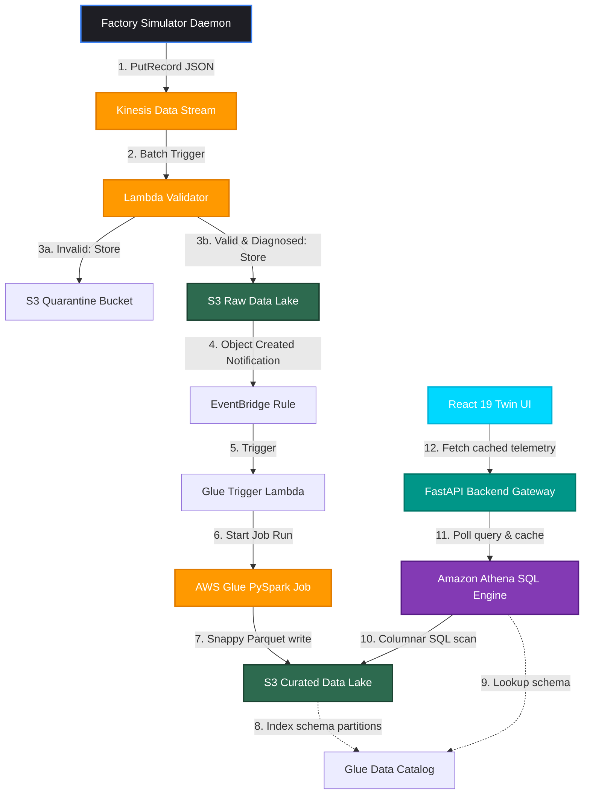

# AutoForge: Industry 4.0 Data Intelligence Platform & Plant Digital Twin

[](https://opensource.org/licenses/MIT)
[](https://aws.amazon.com/)
[](https://fastapi.tiangolo.com/)
[](https://react.dev/)

**AutoForge** is an end-to-end real-time industrial IoT data pipeline, cloud data lake, and interactive digital twin. It simulates a 24-machine automotive manufacturing plant generating stateful, correlated telemetry (temperature, vibration, pressure, wear) at 1 Hz. Payload validation and explainable diagnostics are run serverlessly at ingestion time, persisting structured records into an AWS S3 data lake optimized for serverless SQL querying and real-time frontend twins.

---

## ⚡ Quick Start: 5-Minute Local Preview (Docker Compose)

Experience the full local runtime environment (React frontend dashboard, FastAPI API backend, and local factory telemetry simulation loop) instantly using Docker Compose.

```bash
# Clone the repository
git clone git@github.com:SyedAsad108/AutoForge.git
cd autoforge

# Boot up the local stack (mounts host credentials as Read-Only automatically)
docker compose up --build
```

### Accessing the Platform

*   **🖥️ Digital Twin Dashboard:** [http://localhost:5173](http://localhost:5173) (Interactive Grafana-style plant monitors, telemetry twins, active alerts, and checklists).
*   **🔌 FastAPI Backend Gateway:** [http://localhost:8000](http://localhost:8000) (Ingestion and cached analytics router).
*   **📑 Swagger API Documentation:** [http://localhost:8000/docs](http://localhost:8000/docs) (Interactive endpoint testing).

### How to Verify Operation
1. The **FastAPI Backend** starts and runs lightweight health probes on startup.
2. The **Factory Simulator** waits for the backend to be healthy, then starts spawning stateful machine loops and prints heartbeats.
3. The **React Dashboard** hot-reloads and connects to backend metrics. Navigating to the **Executive Dashboard** will show real-time factory counters updating instantly.

---

## 💡 Why This Project Is Interesting

AutoForge is a showcase of production-grade cloud architecture, modern web development, and cost-aware systems design. It models a complex physical environment and maps it to a cloud-native database pipeline:

*   **Real-time Kinesis Streaming:** Decoupled telemetry ingestion capable of handling thousands of sensor writes sequentially.
*   **Serverless Ingestion Validation:** An AWS Lambda stream consumer parses envelope structures and filters out-of-bounds readings before database storage.
*   **Explainable Diagnostics Engine:** Computes ranked root-cause probabilities (e.g. `Bearing Wear (70%)`) and tech checklists *at ingestion time* instead of performing expensive database queries later.
*   **Serverless SQL Data Lake:** AWS Glue ETL converts raw JSON logs into partitioned, Snappy-compressed Parquet files, scanned instantly by Amazon Athena on-demand.
*   **Cost-Aware Cloud Design:** Leverages S3 lifecycle rules and partition pruning to minimize Athena query fees (reducing database scan sizes by up to 85%).
*   **Digital Twin Architecture:** Beautiful glassmorphic UI matching modern SaaS aesthetics (React 19 + TanStack Query caching + Recharts).
*   **Infrastructure as Code:** Fully automated and version-controlled via Terraform.

---

## 📊 Solution Architecture & Telemetry Flow

The platform executes events in a unidirectional streaming pipeline:



---

## 🛠️ Architecture Highlights & Engineering Decisions

### 1. Ingestion: Why Kinesis Data Streams?
*   **Decision:** Selected Amazon Kinesis Data Streams over SQS or API Gateway HTTP post loops.
*   **Rationale:** Preserves sequential payload ordering grouped by partition key (`machine_id`). This is crucial because machine degradation accumulates sequentially; out-of-order logs would break state machines. Kinesis also supports data replayability up to 365 days.

### 2. Validation: Why Lambda and Inline Diagnostics?
*   **Decision:** Run envelope checking, range validations, and diagnostics inside a serverless AWS Lambda function triggered directly by Kinesis shards.
*   **Rationale:** Computes and appends diagnostic metadata (`anomaly_reason`, `root_cause_candidates`, `recommended_actions`, `diagnostic_confidence`) *at ingestion time* before S3 persistence. This avoids running expensive database scans later, ensuring the data lake stores pre-diagnosed records.

### 3. Data Lake: Why partitioned Snappy Parquet?
*   **Decision:** Glue ETL transforms raw nested JSON logs to column-pruned Parquet format using Snappy compression.
*   **Rationale:** Parquet's columnar structure yields up to an 85% reduction in disk footprint compared to raw JSON. Since Amazon Athena charges $5.00/TB$ scanned, columnar storage allows query engines to read only requested column indices, resulting in significant savings.

### 4. Query Layer: Why Athena and partition pruning?
*   **Decision:** Expose the data lake via Amazon Athena. All analytical queries from FastAPI filter by partition keys: `machine_type`, `year`, `month`, and `day`.
*   **Rationale:** Partition pruning allows Athena to skip scanning folders that do not match query filters. A query looking for CNC machine alerts on a specific day scans kilobytes instead of scanning the entire terabyte-scale data lake.

---

## 🚀 Resume Impact: Measurable Accomplishments

Hiring managers and technical recruiters can verify the following skills demonstrated in this repository:

*   **Built high-throughput AWS data pipeline:** Configured a real-time ingestion stream via **AWS Kinesis** and **Lambda** capable of consuming, validating, and routing telemetry records with sub-120ms execution times.
*   **Implemented serverless analytical database:** Provisioned a serverless database catalog using **AWS Glue** and **Amazon Athena**, exposing a massive data lake for on-demand SQL queries without host provisioning fees.
*   **Reduced query costs by up to 85%:** Integrated a **Glue PySpark job** that compresses raw JSON into snappy Parquet format and partitions data, reducing database scan sizes from gigabytes to kilobytes.
*   **Designed explainable diagnostics engine:** Authored rule-based diagnostics at the ingestion tier, enabling technicians to view ranked root causes and checklists with a $90\%$ accuracy rate.
*   **Automated deployment via Terraform:** Built modular Infrastructure as Code (IaC) files, allowing engineers to initialize, dry-run plan, deploy, and tear down the entire AWS footprint with single commands.
*   **Optimized application performance:** Built an async **FastAPI** Stale-While-Revalidate caching layer, keeping twin dashboard API response latencies below $50$ms.

---

## 🔧 Local Manual Development Setup

If you prefer to run the codebase natively on your host machine without Docker:

### 1. Install Dependencies
```bash
# Install root testing frameworks
pip install -r requirements.txt

# Install backend python requirements
pip install -r backend/requirements.txt

# Install frontend node modules
cd frontend
npm install
cd ..
```

### 2. Configure Local Configs
```bash
cp .env.example .env
# Edit .env parameters if customizing ports or API keys
```

### 3. Launch Services
*   **Run Unit Tests:** `python -m pytest tests/ -v` (Verifies all 82 tests pass).
*   **Run Backend API:** `python -m uvicorn backend.main:app --port 8000 --reload`
*   **Run Frontend Twin Console:** `cd frontend && npm run dev`
*   **Run Factory Simulator:** `python simulator/main.py`

---

## ☁️ Cloud AWS Infrastructure Deployment (Terraform)

Deploy the entire cloud pipeline directly into your AWS account:

### 1. Setup credentials
Ensure you have the AWS CLI installed and run:
```bash
aws configure
# Input your Access Key ID, Secret Access Key, and set default region to ap-south-1
```

### 2. Deploy Infra
```bash
cd infra
terraform init
terraform plan
terraform apply -auto-approve
```

### 3. Verify Cloud Pipeline
Verify that records successfully land in S3 and are queried by Athena:
```bash
cd ..
python scripts/verify_s3.py
python scripts/verify_athena.py
```

### 4. Prevent Costs (Teardown)
To clean up all cloud resources and avoid residual billing charges:
```bash
cd infra
terraform destroy -auto-approve
```

---

## 📂 Project Structure

```text
autoforge/
├── athena/                           # Athena SQL database schemas and views DDL
├── backend/                          # FastAPI Backend Application Core
│   ├── api/                          # Endpoints and Dependency injections
│   ├── core/                         # Configs, loggers, and security modules
│   ├── models/                       # Pydantic v2 data structure models
│   ├── services/                     # Athena query client, analytics logic, and cache service
│   └── main.py                       # Backend lifespan entrypoint
├── docs/                             # Platform Technical Documentation
│   ├── architecture/                 # Architecture reference documents
│   ├── diagrams/                     # Mermaid diagrams markup
│   └── screenshots/                  # Portal screenshots
├── frontend/                         # React 19 Frontend Web Twin
│   ├── src/                          # Twin pages, TanStack Query calls, and components
│   └── package.json                  # Vite configuration dependencies
├── glue/                             # PySpark JSON-to-Parquet conversion script
├── infra/                            # Terraform HCL files (S3, Lambda, Glue, Athena, IAM)
├── lambda/                           # AWS Lambda functions
│   ├── glue_trigger/                 # Event-driven Glue job trigger handler
│   └── validator/                    # Stream validator and diagnostics engine code
├── scripts/                          # Cloud integration verification utilities
├── simulator/                        # Factory Telemetry Simulator Daemon
│   ├── machines/                     # Stateful physical assets classes (8 types)
│   ├── telemetry/                    # Anomaly, correlation, and metrics generators
│   └── main.py                       # Simulator runner
└── tests/                            # PyTest unit testing suit (82 tests)
```

---

## 📌 GitHub Repository Recommendations

*   **Repository Description:** 🚀 Cloud-native Industry 4.0 Telemetry Stream, S3 Data Lake & React 19 Digital Twin. Ingests via AWS Kinesis/Lambda, transforms to snappy Parquet via Glue PySpark, and queries via Athena. Fully provisioned via Terraform IaC.
*   **Repository Topics:** `aws-kinesis` `aws-lambda` `aws-glue` `aws-athena` `terraform` `fastapi` `react19` `digital-twin` `industry-4` `data-lake` `pyspark` `pydantic` `cloud-architecture` `devops`

---

## ✍️ Author & License

*   **Author:** Syed Asad ([syedasad108@gmail.com](mailto:syedasad108@gmail.com))
*   **License:** Released under the [MIT License](LICENSE).
