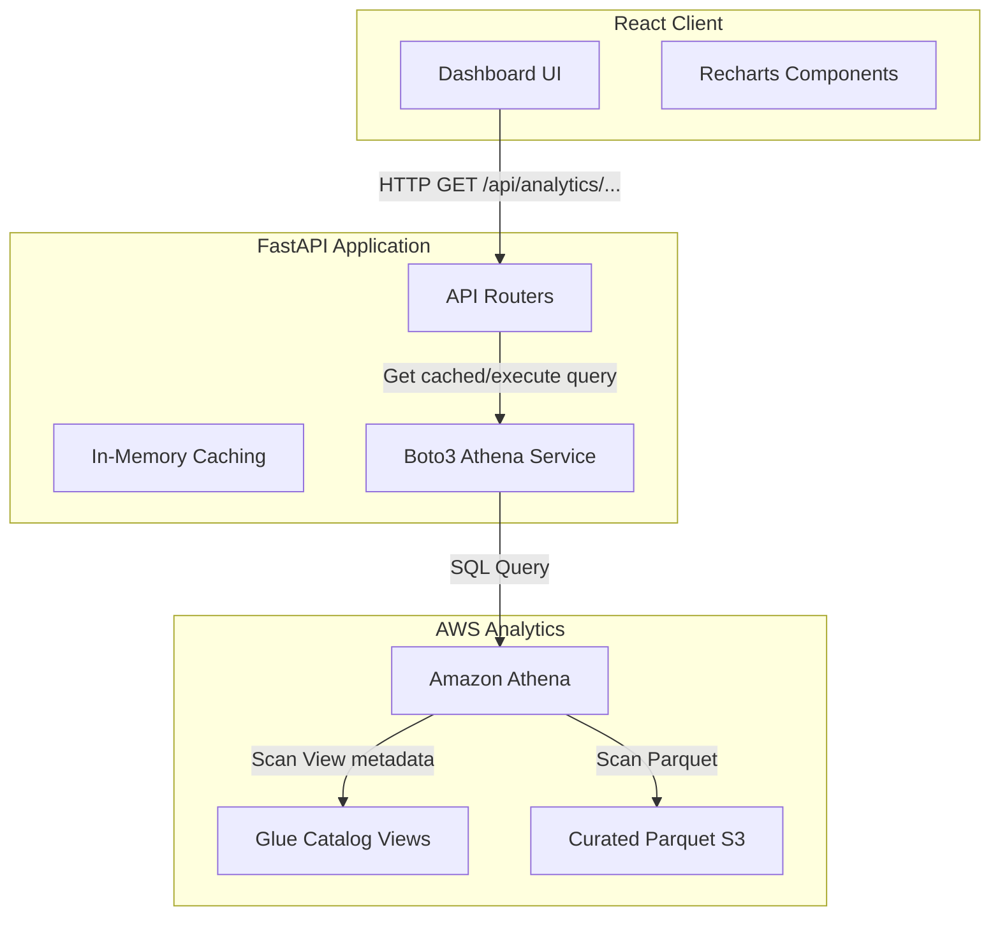

# Phase 9 Preparation Plan — Analytics API & React Dashboard

This document outlines the implementation plan for Phase 9, connecting the Athena Analytics Layer to a FastAPI web service and a React-based monitoring dashboard.

---

## 1. Architecture Overview

---

## 2. Backend Design: FastAPI Analytics API

A new API router `/api/routes/analytics.py` will handle connection to Athena using `boto3`. To optimize performance and reduce AWS costs, we will use a strict caching strategy.

### Athena Query Execution Helper (`backend/services/athena_service.py`)
* **Asynchronous Execution**: Queries will be executed using a worker thread pool or asyncio loops to prevent blocking.
* **Polling Loop**: Implements exponential backoff (e.g. starting at 100ms, max 1s) to poll query status.
* **Result Parsing**: Utility to map Athena's column-oriented `VarCharValue` response format into standard Python dictionaries.
* **In-Memory Cache**: Cache results for up to 5 minutes to prevent redundant scans.

### Target API Endpoints

1. **`GET /api/analytics/health`**
   * **SQL Source**: `SELECT * FROM machine_health_view;`
   * **Description**: Returns all machines with their operational status, average temperature, anomaly count, and degradation level.

2. **`GET /api/analytics/anomalies`**
   * **SQL Source**: `SELECT * FROM anomaly_summary_view;`
   * **Description**: Returns anomaly count by type and machine type, allowing the frontend to display fault category distributions.

3. **`GET /api/analytics/summary/daily`**
   * **SQL Source**: `SELECT * FROM daily_factory_summary_view;`
   * **Description**: Returns aggregated daily factory volume, active machines, and average degradation level to draw historical line charts.

4. **`GET /api/analytics/energy`**
   * **SQL Source**: `SELECT machine_type, total_energy_units FROM (...)`
   * **Description**: Returns total energy units consumed by machine type for resource optimization analysis.

---

## 3. Frontend Design: React Dashboard UI

The frontend will be built as a single-page React app (or Next.js page) displaying key operational and analytics insights.

### UI Components & Layout

1. **Metric Summary Grid (KPI Cards)**:
   * **Overall Health**: Circular progress bar or status ring based on the percentage of healthy machines.
   * **Active Anomalies Count**: Highlighted value showing the number of anomalies detected today.
   * **Data Ingestion Volume**: Raw telemetry counter displaying total ingested records.

2. **Historical Performance Charts**:
   * **Ingestion Volume & Degradation Trends**: Dual-axis line chart using **Recharts** plotting daily record count on Y1 and average degradation level on Y2.
   * **Anomaly Distribution**: Horizontal bar chart showing occurrences grouped by anomaly type.

3. **Live Machine Registry Grid**:
   * A searchable, sortable data table displaying all machines.
   * Visual indicators for status (`healthy` = green indicator, `warning` = yellow, `anomaly` = pulsing red).
   * Progress bars showing machine degradation levels (0.0 to 1.0).

---

## 4. Performance & Cost Mitigation Strategy

To keep Phase 9 performant and cost-efficient:
* **Enforced Partition Pruning**: The FastAPI server will automatically append partition filters (e.g., `year = CURRENT_YEAR AND month = CURRENT_MONTH`) to queries when the user requests date-specific scopes.
* **Athena Query Reuse**: Query results will be saved in the Athena S3 query results bucket; if the same dataset is queried within the cache TTL, FastAPI will fetch the past execution CSV rather than triggering a new query.
