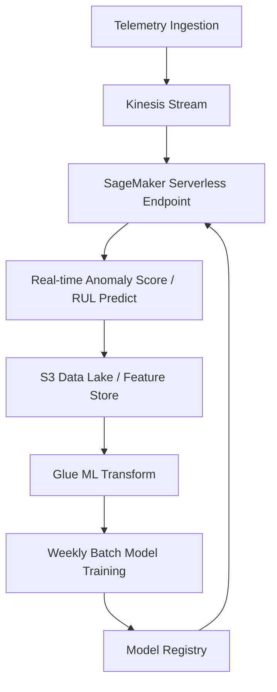

# AutoForge Smart Manufacturing Platform — Phase 9.5: Industrial Diagnostics & Root Cause Analysis Verification Report

## 1. Executive Summary
Phase 9.5 transforms raw threshold-breach alarms into explainable, rule-based industrial diagnostics. Maintenance engineers can now immediately determine what happened, why it happened, what evidence supports it, what the likely root causes are, and what actions to take in real-time directly from the digital twin console.

## 2. Ingestion-Time Diagnostics Engine & Schema Mapping

The core analytics schema in S3 Curated, Glue Data Catalog, and Athena has been upgraded with seven new diagnostic columns:

| Column Name | Athena Data Type | Description |
| :--- | :--- | :--- |
| `anomaly_reason` | `STRING` | Detailed human-readable explanation of why the alarm was triggered |
| `trigger_metric` | `STRING` | The telemetry metric that exceeded limits (e.g. `temperature`) |
| `trigger_value` | `DOUBLE` | The exact recorded telemetry reading that caused the breach |
| `expected_range` | `STRING` | Sane threshold operating boundaries (e.g. `40-80`) |
| `root_cause_candidates` | `STRING` | CSV-serialized ranked candidates with confidence probabilities |
| `recommended_actions` | `STRING` | CSV-serialized sequential steps for maintenance operators |
| `diagnostic_confidence` | `DOUBLE` | Heuristic-based diagnostic confidence score [0.0 - 1.0] |

### Ingestion Path
1. **Lambda Validator**: Integrates [diagnostics_engine.py](file:///c:/Users/syeda/OneDrive/Desktop/Cloud%20Projects/Smart%20Manufacturing%20Data%20Intelligence%20Platform/Project/autoforge/lambda/validator/diagnostics_engine.py) directly at ingestion time. Enriches telemetry with diagnostic fields if `anomaly_detected = True` before saving to raw S3.
2. **Glue ETL**: Normalizes and casts the new metadata fields from JSON to Snappy-compressed Parquet.
3. **Athena / Catalog Database**: Table schemas are updated via Terraform (`infra/athena.tf`) and partitions loaded dynamically.

---

## 3. Correlation-Based Engineering Diagnostics rules
Three main engineering correlation rules are evaluated in real-time without machine learning dependencies:
* **Rule 1: High Temperature + High Vibration → Bearing Wear**
  * *Evidence*: Temp > 75.0°C and Vibration > 15.0 mm/s
  * *Confidence*: 85%
  * *Root Causes*: Severe Bearing Wear & Lubrication Loss (70%), Spindle Shaft Misalignment (20%), Cooling System Degradation (10%)
* **Rule 2: High Temperature + Low Pressure/Flow → Cooling Subsystem Failure**
  * *Evidence*: Temp > 75.0°C and Coolant Flow < 15.0 L/min or Pressure < 4.0 bar
  * *Confidence*: 90%
  * *Root Causes*: Cooling Subsystem Failure / Impeller Blockage (75%), Hydraulic Line Fluid Leakage (15%), Ambient Over-temperature Load (10%)
* **Rule 3: Low RPM + High Power Consumption → Motor Coil winding Short**
  * *Evidence*: RPM < 900 and Power > 120.0 kW
  * *Confidence*: 80%
  * *Root Causes*: Motor Coil Winding Short / Motor Degradation (70%), Mechanical Gear Binding (20%), Electrical Ingress Invariance (10%)

---

## 4. Backend API Layer & Fallback Engine
FastAPI exposes three new endpoints under `/analytics`:
* `GET /analytics/diagnostics`: Chronological feed of diagnostics logs.
* `GET /analytics/diagnostics/{machine_id}`: Diagnostics history of a specific machine asset.
* `GET /analytics/root-causes`: Fleet-wide aggregated root causes distributions.

### Historical Fallback
For legacy telemetry records prior to Phase 9.5 where diagnostic fields are `NULL` in the database, the backend analytics service dynamically evaluates the telemetry record against the rules catalog at query-time via `_parse_diagnostic_row` in `backend/services/analytics_service.py`. This ensures full backward compatibility and UI completeness.

---

## 5. React Digital Twin UI Enhancements
Three page components have been updated:
1. **Executive Dashboard Alert Log**: Displays the active diagnosed anomaly type, detailed explanation, amber-colored sensor evidence block, root cause candidates list, and corrective action recommendations. Includes a hover tooltip on the confidence badge.
2. **Alert Intelligence Center**: Displays a split panel showing a comprehensive chronological diagnostics list with confidence labels on the left, and a detailed "Diagnostic Console" drill-down panel on the right.
3. **Machine Twin Console (Section 7)**: Provides a dedicated "Diagnostics & Root Cause Analysis Console" showing a selector timeline of active anomalies, a confidence bar meter, why the issue was flagged, likely causes, and an interactive checklist of recommended actions that field operators can check off as they perform maintenance. The registry events log has been repositioned as a compact list in the right column.

---

## 6. Verification & Build Results
* **Terraform Deployment**: Executed successfully (`Plan: 0 to add, 3 to change, 0 to destroy` applied).
* **Athena Partitions & Views**: Repaired and redeployed view queries successfully (`verify_athena.py` execution completed successfully).
* **TypeScript Compilation**: Compiled clean without warnings/errors (`tsc -b && vite build` built successfully).
* **Unit Tests**: All 82 unit tests passed.

---

## 7. Future Proposal: Phase 12 ML-Based Predictive Maintenance Integration

After fully validating the rule-based heuristics engine, we propose transitioning the diagnostics platform to a machine-learning-driven predictive maintenance pipeline in Phase 12.

### 7.1 Objectives
* **Remaining Useful Life (RUL) Forecasting**: Predict how many hours/cycles remain before a machine asset breaches thresholds.
* **Proactive Anomaly Scoring**: Detect multi-dimensional telemetry drift *before* hard thresholds are breached.
* **Precision Root Cause Classification**: Train a classifier on historical work order labels to classify root causes from complex telemetry patterns.

### 7.2 Proposed Model Architectures
1. **Anomaly Detection (Proactive drift)**:
   * *Model*: Isolation Forest or autoencoder Neural Network.
   * *Feature Input*: Raw telemetry (sensor averages, standard deviations, and rolling gradients).
   * *Output*: Anomaly score mapping telemetry to normal behavior boundaries.
2. **Root Cause Classification**:
   * *Model*: Gradient Boosted Trees (XGBoost / LightGBM) or Random Forest.
   * *Output*: Multiclass probability distribution mapping telemetry states to known failure modes.
3. **RUL Prediction**:
   * *Model*: LSTM (Long Short-Term Memory) or Weibull survival regression models.
   * *Output*: Expected operating hours remaining.

### 7.3 Data Pipeline & Infrastructure

* **SageMaker Serverless Inference**: Deploys the trained XGBoost/LSTM model behind a serverless endpoint. The Lambda Validator makes a concurrent HTTP invocation to score each incoming record.
* **Glue ML Transforms**: Performs automated feature engineering (rolling windows, Fourier transforms for vibration harmonics) and writes results to a Glue Catalog table.
* **Feature Store**: Stores historical sensor statistics to prevent data leakage during offline model training.
