# AutoForge Ingestion Loop & Telemetry Activity Redesign Report

This document outlines the architecture, data-flow patterns, query implementations, and operational business rules backing the new **Telemetry Activity & Ingestion Health** panel in the AutoForge Manufacturing Intelligence dashboard.

---

## 1. Physical Architecture & Data Flow

The telemetry collection loop functions as an asynchronous real-time ingestion pipeline:

```mermaid
graph LR
    Sim[Factory Simulator] -- JSON Events --> KDS[Kinesis Data Stream]
    KDS -- Batch Trigger --> Lam[Lambda Validator]
    Lam -- S3 Raw JSON --> S3Raw[Raw S3 Bucket]
    S3Raw -- EventBridge / SQS --> Glue[Glue ETL Job]
    Glue -- Parquet Partitions --> S3Cur[Curated S3 Bucket]
    S3Cur -- Schema Metadata --> Athena[Athena Query Engine]
    Athena -- SQL Analytics --> API[FastAPI Analytics Service]
    API -- JSON Response --> React[React Intelligence Center]
```



---

## 2. Dynamic Time Series & Aggregation Queries

Rather than querying a static calendar view, the redesigned service queries `telemetry_curated` directly using dynamic aggregation buckets dependent on the user-selected interval window. 

### A. Dynamic Time Anchor Selection
To ensure charts function correctly even when the simulator is paused or when historical gaps occur, the engine queries the latest available timestamp in the data lake:
```sql
SELECT MAX(timestamp) AS max_ts, MIN(timestamp) AS min_ts FROM telemetry_curated;
```
All subsequent queries use this `max_ts` as the anchor time (instead of the current system time), ensuring stable charts and preventing empty visualizations during periods of simulator inactivity.

### B. Time-Series Aggregations by Window
The grouping granularity automatically adapts to the window size to avoid rendering excessive series points or single collapsed data points:

| Selected Window | Duration | Grouping Expression | Time-Label Output | Bucket Size |
| :--- | :--- | :--- | :--- | :--- |
| **15 Minutes (15m)** | Last 15 mins | `SUBSTR(timestamp, 1, 16)` | `HH:MM` (Minute) | 1 Minute |
| **1 Hour (1h)** | Last 1 hour | `SUBSTR(timestamp, 1, 16)` | `HH:MM` (Minute) | 1 Minute |
| **24 Hours (24h)** | Last 24 hours | `SUBSTR(timestamp, 1, 13)` | `HH:00` (Hour) | 1 Hour |
| **7 Days (7d)** | Last 7 days | `SUBSTR(timestamp, 1, 10)` | `MM-DD` (Day) | 1 Day |

The Athena SQL query executed is:
```sql
SELECT
    {SUBSTR_EXPRESSION} AS time_bucket,
    COUNT(*) AS total_events,
    SUM(CASE WHEN anomaly_detected = true THEN 1 ELSE 0 END) AS anomaly_count,
    SUM(CASE WHEN status = 'healthy' THEN 1 ELSE 0 END) AS healthy_count,
    SUM(CASE WHEN status = 'warning' THEN 1 ELSE 0 END) AS warning_count,
    SUM(CASE WHEN status IN ('critical', 'anomaly') THEN 1 ELSE 0 END) AS critical_count
FROM telemetry_curated
WHERE timestamp >= '{start_timestamp}' AND timestamp <= '{end_timestamp}'
GROUP BY {SUBSTR_EXPRESSION}
ORDER BY time_bucket ASC;
```

---

## 3. Operational KPI Formulas

To assist supervisors on the floor, the dashboard computes 5 core ingestion KPIs:

### 1. Telemetry Events
* **Definition**: Total processed event packets in the selected period.
* **Formula**:
  $$\text{Total Events} = \sum \text{total\_events}_{\text{bucket}}$$

### 2. Telemetry Rate
* **Definition**: Average events received per minute.
* **Formula**:
  $$\text{Rate} = \frac{\text{Total Events}}{\text{Window Duration (minutes)}}$$

### 3. Peak Activity
* **Definition**: The maximum event spike observed in a single time slice, normalized to events/minute.
* **Formula**:
  $$\text{Peak} = \max\left( \frac{\text{Events}_{\text{bucket}}}{\text{Minutes per bucket}} \right)$$
  *(Where minutes per bucket is: 1.0 for minute-grouped, 60.0 for hour-grouped, 1440.0 for day-grouped)*

### 4. Anomaly Rate
* **Definition**: Percentage of anomalous events detected in the window.
* **Formula**:
  $$\text{Anomaly Rate} = \frac{\sum \text{anomaly\_count}_{\text{bucket}}}{\text{Total Events}} \times 100$$

### 5. Ingestion Trend
* **Definition**: Ingestion count percentage change compared with the preceding period of equal length.
* **Formula**:
  $$\text{Trend \%} = \frac{\text{Total Events}_{\text{current}} - \text{Total Events}_{\text{prior}}}{\text{Total Events}_{\text{prior}}} \times 100$$

---

## 4. Ingest Pipeline Health Diagnostics

Pipeline statuses are derived dynamically from telemetry freshness. Freshness represents the delta between the current system time (UTC) and the latest event timestamp:

$$\text{Freshness} = \text{SystemTime}_{\text{UTC}} - \text{LatestTimestamp}_{\text{Lake}}$$

### Component Health States Mapping

| Freshness Delta (seconds) | Simulator Status | Kinesis Status | Lambda Status | Glue ETL | Athena | Description |
| :--- | :--- | :--- | :--- | :--- | :--- | :--- |
| **0 – 45 seconds** | Active | Streaming | Processing | Operational | Queryable | System is in nominal running mode. Live data flowing. |
| **45 – 300 seconds** | Idle | Streaming | Processing | Operational | Queryable | Simulator is paused or no events are being triggered. |
| **Above 300 seconds** | Inactive | Inactive | Inactive | Operational | Queryable | Telemetry flow halted. Ingestion components are sleep-throttled. |

---

## 5. Insight Generation Logic

The panel displays narrative insights dynamically compiled in the python backend:

1. **Volume Trend Insight**:
   - If $\text{Trend} \ge 5\%$: *"Factory telemetry volume has increased by {trend}% during the analyzed interval."*
   - If $\text{Trend} \le -5\%$: *"Factory telemetry volume has decreased by {trend}% compared to the previous period."*
   - Else: *"Telemetry generation is currently stable compared to the previous period."*

2. **Anomaly Status Insight**:
   - If $\text{Anomaly Rate} > 15\%$: *"Anomalous telemetry is highly elevated at {anomaly_rate}%. Immediate hardware inspection advised."*
   - Else: *"Anomaly frequency remains stable despite changes in production activity."*

3. **Breakdown Concentration Insight**:
   - Identifies the machine class contributing the highest share of event packets:
     *"Telemetry generation is concentrated in {Machine Type} systems ({percentage}% share)."*
